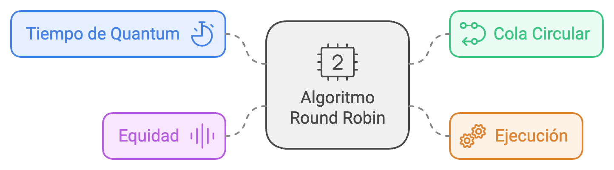
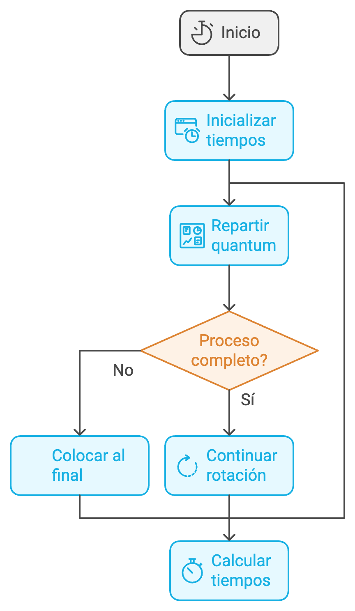

# Algoritmo Round Robin en C

## Descripción

El algoritmo Round Robin (RR) es una técnica de planificación de procesos ampliamente utilizada en sistemas operativos. Se caracteriza por asignar un intervalo de tiempo fijo, llamado **quantum**, a cada proceso en una cola circular. Este enfoque garantiza que todos los procesos obtengan un acceso equitativo a la CPU.

El algoritmo es ideal para sistemas multitarea y tiempo compartido, donde la respuesta rápida a los procesos es crucial.



---

## Características del Algoritmo Round Robin

1. **Tiempo de Quantum**:
   - Define el período máximo durante el cual un proceso puede usar la CPU antes de ser interrumpido.
   
2. **Cola Circular**:
   - Los procesos listos para ejecutarse se organizan en una cola FIFO (First In, First Out).
   
3. **Ejecución**:
   - Cada proceso recibe tiempo de CPU igual al quantum hasta que se completa o su tiempo restante se reduce a cero.

4. **Equidad**:
   - Todos los procesos tienen la misma prioridad y se ejecutan en ciclos rotativos.

---


## Funcionamiento

### Pasos del Algoritmo:

1. Inicializar los tiempos restantes para cada proceso con su tiempo de ráfaga.
2. Repartir el quantum entre los procesos en orden de llegada.
3. Si un proceso no se completa en su quantum, se coloca al final de la cola.
4. Continuar la rotación hasta que todos los procesos se completen.
5. Calcular los tiempos de espera y turnaround.


### Fórmulas:
- **Tiempo de espera (Waiting Time)**:
  \[
  WT[i] = (Tiempo\ total\ de\ ejecución) - Tiempo\ de\ ráfaga[i]
  \]

- **Turnaround Time**:
  \[
  TAT[i] = WT[i] + Tiempo\ de\ ráfaga[i]
  \]

---

## Implementación en C

El programa simula la planificación de procesos utilizando el algoritmo Round Robin y calcula:
- Tiempos de espera
- Tiempos de finalización (Turnaround Time)
- Promedios de los tiempos calculados

### Archivos del Proyecto
- `round_robin.c`: Código fuente de la implementación en C.
- `README.md`: Archivo explicativo.

---

## Cómo Usar

### Requisitos
- Un compilador de C (por ejemplo, GCC).
- Sistema operativo con soporte para compilación de C.

### Instrucciones

1. Compilar el archivo `round_robin.c`:
   ```bash
   gcc round_robin.c -o round_robin
   ```

2. Ejecutar el programa:
   ```bash
   ./round_robin
   ```

3. Ingresar los datos requeridos:
   - Número de procesos.
   - Tiempo de ráfaga para cada proceso.
   - Valor del quantum.

4. Revisar la salida en pantalla, que incluye:
   - Tiempos de espera de cada proceso.
   - Turnaround Time.
   - Promedios calculados.

---

## Ejemplo

### Entrada
```plaintext
Ingrese el número de procesos: 3
Ingrese los tiempos de ráfaga para cada proceso:
Proceso 1: 10
Proceso 2: 5
Proceso 3: 8
Ingrese el tiempo de quantum: 4
```

### Salida
```plaintext
Proceso	Tiempo de ráfaga	Tiempo de espera	Turnaround time
P1		10			10			20
P2		5			3			8
P3		8			7			15

Promedio de tiempo de espera: 6.67
Promedio de turnaround time: 14.33
```

---

## Notas

1. **Quantum Apropiado**:
   - Un quantum muy pequeño genera muchos cambios de contexto, aumentando el overhead.
   - Un quantum muy grande se asemeja a la planificación FCFS, aumentando los tiempos de espera para procesos más cortos.

2. **Extensibilidad**:
   - Esta implementación puede ampliarse para incluir tiempos de llegada de los procesos o prioridades.

---

## Contribución

Si deseas contribuir con mejoras o nuevas características, siéntete libre de hacer un fork del proyecto y enviar un pull request.

---

## Licencia

Este proyecto es de dominio público. Puedes usarlo, modificarlo y distribuirlo libremente.

